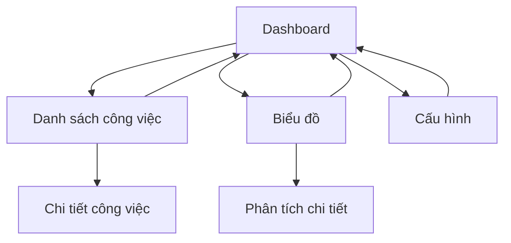

# Tài liệu Yêu cầu Sản phẩm - Dashboard Quản lý Tiến độ Công việc

## 1. Tổng quan Sản phẩm
Ứng dụng Dashboard Quản lý Tiến độ Công việc là một hệ thống web giúp theo dõi và quản lý tiến độ các công việc/dự án từ dữ liệu Google Sheets. Ứng dụng cung cấp giao diện trực quan để hiển thị thống kê tổng quan, chi tiết công việc và biểu đồ tiến độ.
- Giải quyết vấn đề theo dõi tiến độ công việc một cách hiệu quả và trực quan cho các nhóm làm việc và quản lý dự án.
- Mục tiêu tạo ra một công cụ đơn giản nhưng mạnh mẽ để quản lý và theo dõi tiến độ công việc trong thời gian thực.

## 2. Tính năng Cốt lõi

### 2.1 Vai trò Người dùng
| Vai trò | Phương thức Đăng ký | Quyền Cốt lõi |
|---------|---------------------|----------------|
| Người dùng | Truy cập trực tiếp | Xem dashboard, theo dõi tiến độ, xem chi tiết công việc |
| Quản trị viên | Cấu hình hệ thống | Toàn quyền quản lý, cấu hình kết nối Google Sheets |

### 2.2 Module Tính năng
Ứng dụng dashboard bao gồm các trang chính sau:
1. **Trang Dashboard**: thống kê tổng quan, biểu đồ tiến độ, cards hiển thị số liệu.
2. **Trang Danh sách công việc**: bảng dữ liệu chi tiết các công việc, bộ lọc và tìm kiếm.
3. **Trang Biểu đồ**: các biểu đồ phân tích tiến độ theo thời gian và trạng thái.
4. **Trang Cấu hình**: cấu hình kết nối Google Sheets API, thiết lập hệ thống.

### 2.3 Chi tiết Trang

| Tên Trang | Tên Module | Mô tả Tính năng |
|-----------|------------|------------------|
| Dashboard | Header Navigation | Hiển thị tiêu đề ứng dụng, menu điều hướng với 4 tabs chính |
| Dashboard | Statistics Cards | Hiển thị 5 cards thống kê: Tổng số công việc, Hoàn thành, Đang thực hiện, Chưa bắt đầu, Tạm dừng |
| Dashboard | Progress Overview | Biểu đồ thanh tiến độ tổng thể với phần trăm hoàn thành theo từng trạng thái |
| Dashboard | Status Legend | Chú thích màu sắc cho các trạng thái (xanh lá - hoàn thành, xanh dương - đang thực hiện, xám - chưa bắt đầu, đỏ - tạm dừng) |
| Danh sách công việc | Data Table | Hiển thị bảng dữ liệu với các cột: ID, Tên công việc, Đơn vị thực hiện, Ngày bắt đầu, Ngày kết thúc, Trạng thái, Tiến độ (%), Ghi chú, Đánh giá |
| Danh sách công việc | Filter & Search | Bộ lọc theo trạng thái, đơn vị thực hiện và tìm kiếm theo tên công việc |
| Danh sách công việc | Progress Bars | Thanh tiến độ trực quan cho từng công việc với màu sắc theo trạng thái |
| Biểu đồ | Timeline Chart | Biểu đồ Gantt hiển thị timeline các công việc |
| Biểu đồ | Status Distribution | Biểu đồ tròn phân bố theo trạng thái công việc |
| Biểu đồ | Progress Trends | Biểu đồ đường xu hướng tiến độ theo thời gian |
| Cấu hình | Webhook Config | Cấu hình Sheet URL và Sheet Name |
| Cấu hình | Refresh Settings | Thiết lập tần suất cập nhật dữ liệu tự động |

## 3. Quy trình Cốt lõi

**Quy trình Người dùng chính:**
1. Người dùng truy cập ứng dụng và được chuyển đến trang Dashboard
2. Xem tổng quan thống kê và biểu đồ tiến độ
3. Chuyển đến tab "Danh sách công việc" để xem chi tiết từng công việc
4. Sử dụng bộ lọc để tìm kiếm công việc theo trạng thái hoặc đơn vị
5. Chuyển đến tab "Biểu đồ" để xem phân tích chi tiết
6. Quản trị viên có thể vào "Cấu hình" để thiết lập kết nối Webhook API

## 4. Thiết kế Giao diện Người dùng

### 4.1 Phong cách Thiết kế
- **Màu sắc chính:** #3B82F6 (xanh dương), #10B981 (xanh lá), #6B7280 (xám), #EF4444 (đỏ)
- **Màu sắc phụ:** #F8FAFC (nền), #FFFFFF (card background)
- **Kiểu nút:** Rounded corners (8px), shadow effects, hover states
- **Font:** Inter, sans-serif với kích thước 14px-16px cho nội dung, 18px-24px cho tiêu đề
- **Kiểu layout:** Card-based design, top navigation với tabs
- **Icons:** Feather icons hoặc Heroicons với style minimalist

### 4.2 Tổng quan Thiết kế Trang

| Tên Trang | Tên Module | Các Thành phần UI |
|-----------|------------|-------------------|
| Dashboard | Header | Background trắng, title "Ứng dụng Quản lý Tiến độ Công việc", subtitle mô tả, navigation tabs với border-bottom active |
| Dashboard | Statistics Cards | 5 cards ngang hàng, background trắng, shadow nhẹ, icon màu tương ứng trạng thái, số liệu lớn bold |
| Dashboard | Progress Section | Card lớn chứa progress bar, title "Tiến độ tổng thể", thanh progress với gradient colors, legend với dots màu |
| Danh sách công việc | Data Table | Table với header background xám nhạt, alternating row colors, progress bars inline, status badges với màu tương ứng |
| Biểu đồ | Chart Container | Cards chứa charts với padding 24px, chart library colors matching status colors |
| Cấu hình | Form Layout | 2 input fields: Sheet URL và Sheet Name với labels, border radius 6px, save button primary color |

### 4.3 Responsive Design
Ứng dụng được thiết kế desktop-first với khả năng responsive cho tablet và mobile. Trên mobile, navigation tabs sẽ chuyển thành dropdown menu, cards sẽ stack vertically, và table sẽ có horizontal scroll.