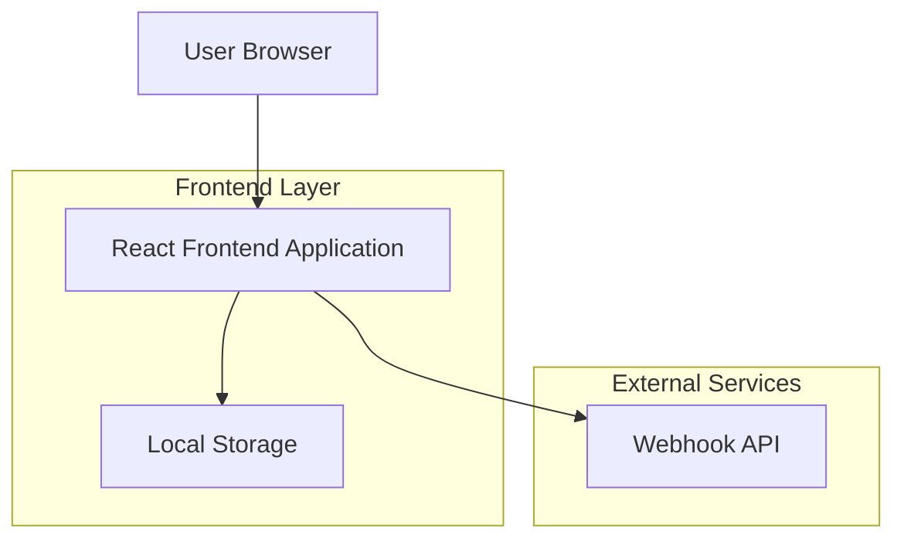
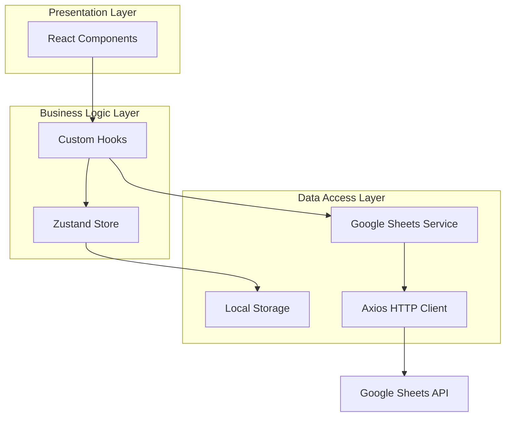
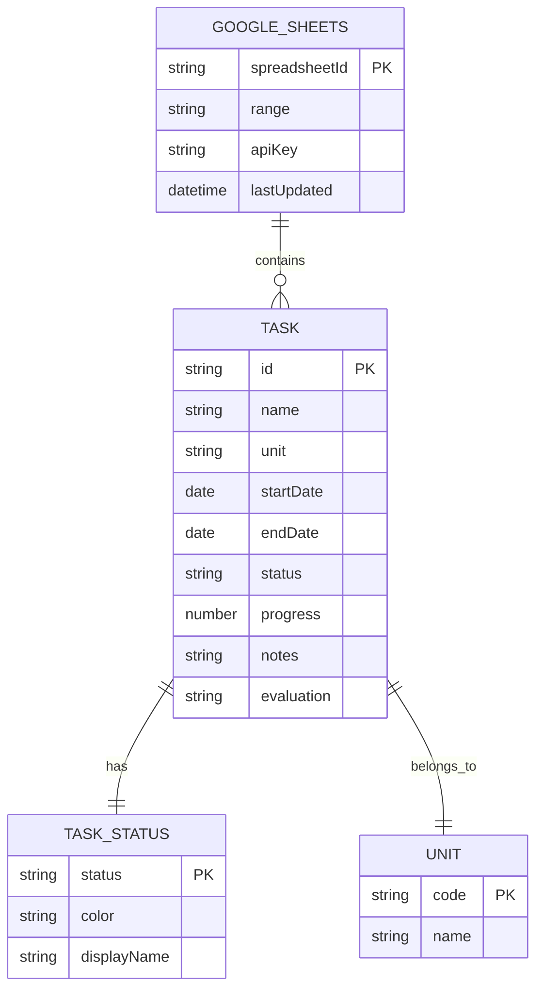

# Tài liệu Kiến trúc Kỹ thuật - Dashboard Quản lý Tiến độ Công việc

## 1. Thiết kế Kiến trúc



## 2. Mô tả Công nghệ

* Frontend: React\@18 + TypeScript\@5 + Vite\@5

* UI Framework: Tailwind CSS\@3 + Headless UI

* Charts: Chart.js\@4 + React-Chartjs-2

* HTTP Client: Axios\@1

* State Management: Zustand\@4

* Date Handling: date-fns\@2

* Icons: Heroicons\@2

* API: Webhook API (không cần Google Sheets API key)

## 3. Định nghĩa Route

| Route     | Mục đích                                                              |
| --------- | --------------------------------------------------------------------- |
| /         | Trang Dashboard chính, hiển thị thống kê tổng quan và biểu đồ tiến độ |
| /tasks    | Trang danh sách công việc với bảng dữ liệu chi tiết và bộ lọc         |
| /charts   | Trang biểu đồ phân tích với các loại chart khác nhau                  |
| /settings | Trang Cấu hình Google Sheets API và thiết lập hệ thống                |

## 4. Định nghĩa API

### 4.1 Core API

Webhook API Integration

```
POST https://67c21da0bd4e.ngrok-free.app/webhook/get-sheet
```

Request Headers:

| Param Name   | Param Type | isRequired | Description      |
| ------------ | ---------- | ---------- | ---------------- |
| Content-Type | string     | true       | application/json |

Request Body:

| Param Name  | Param Type | isRequired | Description               |
| ----------- | ---------- | ---------- | ------------------------- |
| sheet\_url  | string     | true       | URL của Google Sheets     |
| sheet\_name | string     | true       | Tên sheet cần lấy dữ liệu |

Example Request:

```json
{
  "sheet_url": "https://docs.google.com/spreadsheets/d/1vy0dgWegn6btmYTPfvpPnWa7o897H39QDnZqnKzhi7E/edit?usp=sharing",
  "sheet_name": "Trang tính1"
}
```

Response:

| Param Name | Param Type | Description                                |
| ---------- | ---------- | ------------------------------------------ |
| data       | array      | Mảng objects chứa dữ liệu từ Google Sheets |

Example Response:

```json
[
  {
    "row_number": 2,
    "ID": 1,
    "Tên Công việc": "làm sạch dữ liệu can phạm",
    "Đơn vị thực hiện": "PV06",
    "Ngày bắt đầu ": "15/9/2025",
    "Ngày kết thúc": "31/10/2025",
    "Trạng thái ": "Đang thực hiện",
    "Tiến độ (% hoàn thành)": 20,
    "Ghi chú - Mô tả": "đẩy nhanh tiến độ",
    "Đánh giá": "chưa tốt"
  }
]
```

### 4.2 Type Definitions

```typescript
interface Task {
  row_number: number;
  ID: number;
  "Tên Công việc": string;
  "Đơn vị thực hiện": string;
  "Ngày bắt đầu ": string;
  "Ngày kết thúc": string;
  "Trạng thái ": TaskStatus;
  "Tiến độ (% hoàn thành)": number;
  "Ghi chú - Mô tả": string;
  "Đánh giá": string;
}

type TaskStatus = 'Đang thực hiện' | 'Đã xong' | 'Chưa bắt đầu' | 'Tạm dừng';

interface DashboardStats {
  total: number;
  completed: number;
  inProgress: number;
  notStarted: number;
  paused: number;
  overallProgress: number;
}

interface WebhookConfig {
  sheet_url: string;
  sheet_name: string;
  refreshInterval: number;
}

interface ApiRequest {
  sheet_url: string;
  sheet_name: string;
}
```

## 5. Kiến trúc Client



## 6. Mô hình Dữ liệu

### 6.1 Định nghĩa Mô hình Dữ liệu



### 6.2 Cấu trúc Dữ liệu Local Storage

```typescript
// Local Storage Keys
const STORAGE_KEYS = {
  WEBHOOK_CONFIG: 'webhookConfig',
  CACHED_TASKS: 'cachedTasks',
  LAST_SYNC: 'lastSync',
  USER_PREFERENCES: 'userPreferences'
};

// Webhook Configuration
interface StoredConfig {
  sheet_url: string;
  sheet_name: string;
  refreshInterval: number; // in minutes
}

// Cached Tasks Data
interface CachedData {
  tasks: Task[];
  timestamp: number;
  stats: DashboardStats;
}

// User Preferences
interface UserPreferences {
  theme: 'light' | 'dark';
  defaultView: 'dashboard' | 'tasks' | 'charts';
  autoRefresh: boolean;
  notificationsEnabled: boolean;
}

// Status Color Mapping
const STATUS_COLORS = {
  'Hoàn thành': '#10B981',     // green
  'Đang thực hiện': '#3B82F6', // blue
  'Chưa bắt đầu': '#6B7280',   // gray
  'Tạm dừng': '#EF4444'        // red
};

// Sample Data Structure
const sampleTaskData: Task[] = [
  {
    row_number: 2,
    ID: 1,
    "Tên Công việc": "làm sạch dữ liệu can phạm",
    "Đơn vị thực hiện": "PV06",
    "Ngày bắt đầu ": "15/9/2025",
    "Ngày kết thúc": "31/10/2025",
    "Trạng thái ": "Đang thực hiện",
    "Tiến độ (% hoàn thành)": 20,
    "Ghi chú - Mô tả": "đẩy nhanh tiến độ",
    "Đánh giá": "chưa tốt"
  },
  {
    row_number: 3,
    ID: 2,
    "Tên Công việc": "làm sạch dữ liệu người nước ngoài",
    "Đơn vị thực hiện": "PA08",
    "Ngày bắt đầu ": "16/9/2025",
    "Ngày kết thúc": "30/9/2025",
    "Trạng thái ": "Đang thực hiện",
    "Tiến độ (% hoàn thành)": 90,
    "Ghi chú - Mô tả": "Cần thêm phản hồi",
    "Đánh giá": "Tốt"
  },
  {
    row_number: 4,
    ID: 3,
    "Tên Công việc": "triển khai đường truyền cho công an các xã",
    "Đơn vị thực hiện": "PV01",
    "Ngày bắt đầu ": "15/7/2025",
    "Ngày kết thúc": "30/7/2025",
    "Trạng thái ": "Đã xong",
    "Tiến độ (% hoàn thành)": 100,
    "Ghi chú - Mô tả": "Hoàn thành tiến độ",
    "Đánh giá": "Tốt"
  }
```

